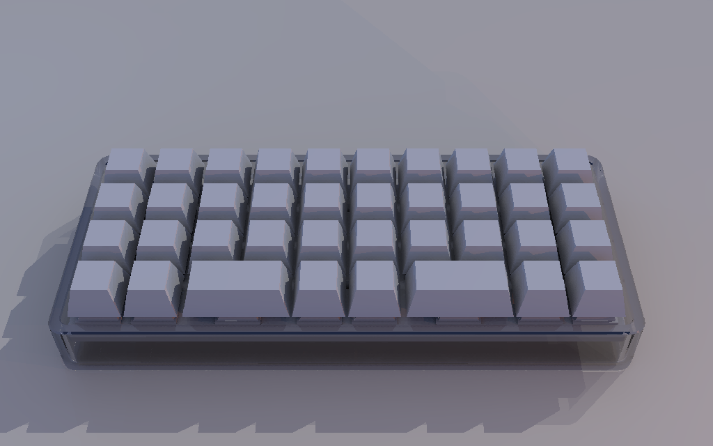

# Untitled QAZ Ortho 38 key

## 📻 Project Description

Yet another untitled QAZ orthographic keyboard.

As much as I like my split keyboards, I wanted to try a small orthographic keyboard as a secondary/backup keyboard when I'm busy writing with pen and paper at my desk. Having to move your hand from the paper is inconvenient, and trying to type on the right hand half of the split keyboard with your left hand is impractical, so I decided to give this keyboard a shot.

[Continue reading...](notes/Design.md)

## 🧰 Features
- 38 keys
- 1× Raspberry Pi Pico w/ USB-C breakout board
- Powered by QMK with Vial support

## 📚 Read more...
- [Design](notes/Design.md)
- [Construction](notes/Construction.md)
- [Firmware](notes/Firmware.md)
- [Gallery](notes/Gallery.md)

## 🙏 Inspired by...
- [QAZ by Coffee Break Keyboards](https://cbkbd.bigcartel.com/product/qaz)
- [Scotto Long by Joe Scotto](https://github.com/joe-scotto/scottokeebs/tree/main/ScottoLong)

## 📐 References
- [Raspberry Pi Pico](https://www.raspberrypi.com/documentation/microcontrollers/raspberry-pi-pico.html)
- [QMK Firmware](https://docs.qmk.fm/)
- [Vial Firmware](https://get.vial.today/)

---