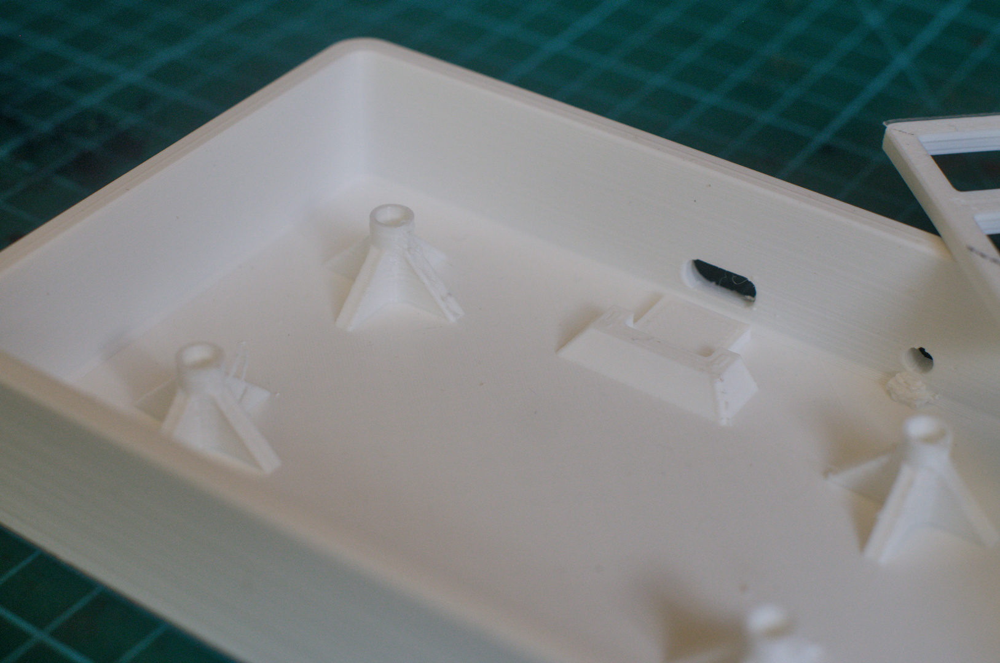
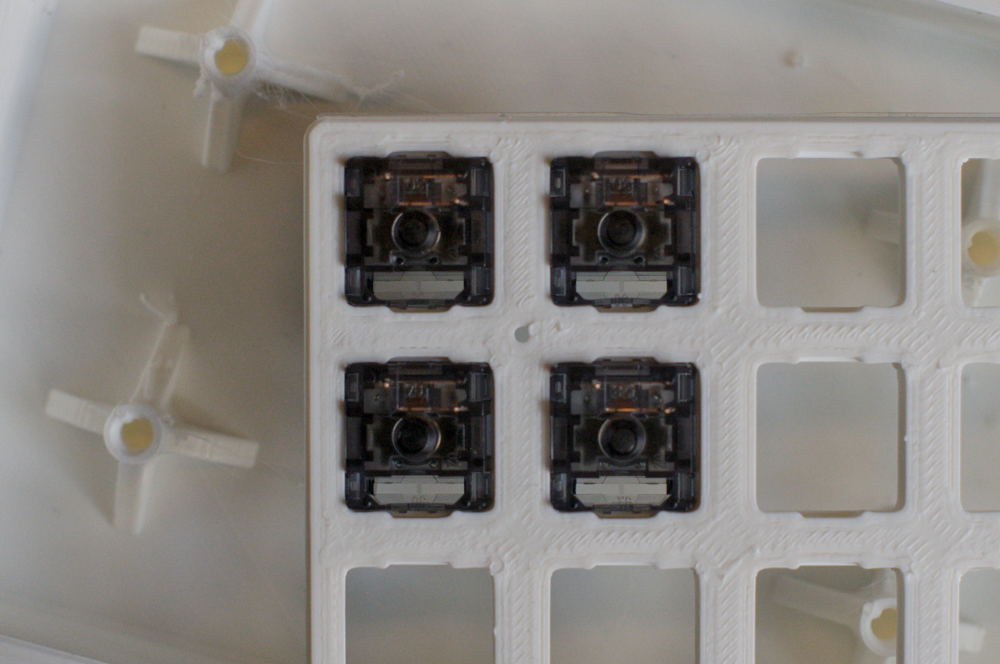
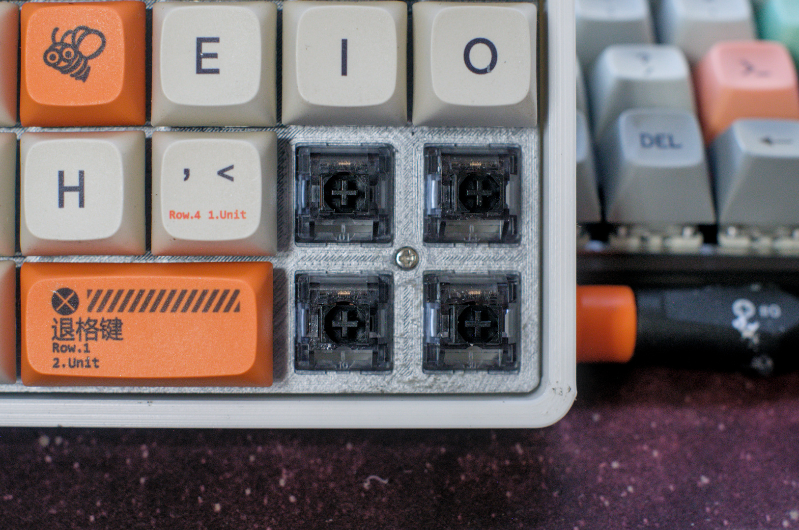
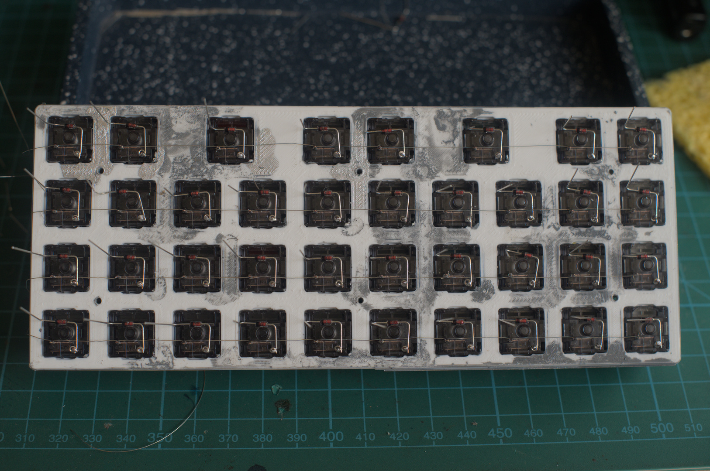
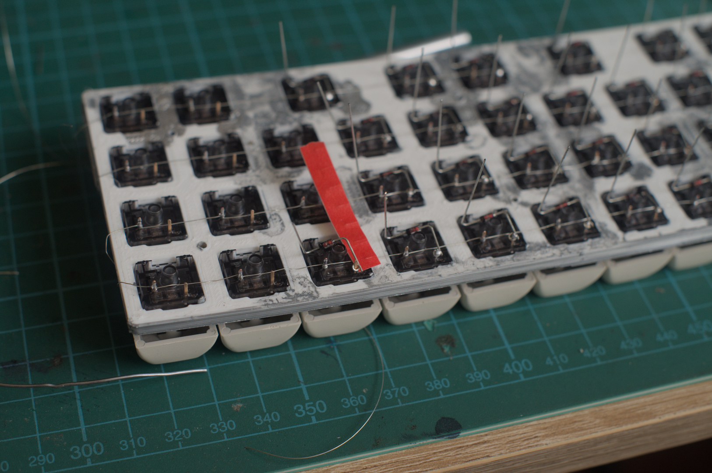

# Construction

## 🛒 Bill of Materials (BOM)

| Item | Size | Qty | 
| ---- | ---- | --- |
| Raspberry Pi Pico | N/A | 1 |
| USB-C Breakout | N/A | 1 | 
| MX Switches | N/A | 38 |
| 1N4148 Diodes | N/A | 38 |
| Heat Set Inserts | M2 ø3.5×6mm | 6 |
| Screws | M2 | 6 |
| Wire | 30AWG | N/A |
| 3D printed shell | N/A | 2 pcs |
| Tactile Switch | 6mm base | 1 pcs |

## USB-C Breakout
The USB-C Breakout board fits nicely in the holder and lines up nicely with the USB-C connector cutout. Hot glue keeps it in place and from rising up and riding over the stopper. I find it's best to plug in a USB cable and make sure the connector is aligned while the glue cools. What I *did* forget was to leave some space beneath where the header pins are soldered.

The BOOTSEL switch doesn't have a stopper, I'm relying entirely on the hot glue to prevent the action of pressing the button to sheer it off the floor of the shell, which is almost certainly bound to happen given enough actuations.

## Switch Plate
The switch plate is 3.5mm thick. To allow the switches to clip in place, there is a cut-out 1.4mm from the top of the plate that is 6mm wide by 0.5mm deep. This time the clip (below where an LED could be placed) on the switches now latches in properly compared to my previous builds.

The head of a M2 screw fits easily between the diagonal of a 2x2 grid of switches. The hole is also small enough to not worry about it interfering with neighbouring switch cut-outs.

 

The biggest problem I have with this keyboard is that after inserting the switches, the entire plate warps.

I made several attempts of placing it under flat heavy loads and/or heating it, but the warping persisted. I can only assume that the dimensions and the tolerances I used for the printer were too tight.

## Hand Wiring/Matrix
For the hand wiring I wanted to try something different that would hopefully be less tedious than the usual method I follow: wire stripping 30 AWG wire with just enough insulation between each joint.

The first plan was to use layers of copper tape and Kapton tape, but the copper tape I had was only conductive on the non-adhesive side, and the Kapton tape was struggling to adhere to anything.

Instead, I stripped the insulation off the entire length of each row's wiring, and hand wrapped it around the pins, making sure to keep the wire as close to the switch and plate base as possible.

Then, when soldering the diodes, I noticed that when placing the pre-wrapped diodes on the switch, they would naturally balance at an angle that would clear them from contacting the row wire. 

The length of a MX switch pin is about 3.3mm. By soldering the diode leg closer to the end of the pin rather than the base of the pin, there is more than enough clearance to avoid them short circuiting (see the switch to the right of the red paper.)

The wires between the cathodes of the diodes still need to have insulation wire-stripped at intervals, but it beats having to do the row as well.

Of course all it would take is one unaccounted-for item inside the case to press up against the switch plate to cause a short-circuit, such as (insulated) wires running between the MCU and the USB-C connector board. I wouldn't use this method if I were building a board for someone else, but for personal use it seems reliable so far.

The major drawback is that if you accidentally remove a switch while trying to pull a keycap, it will almost certainly snap the row wiring due to it only being 30AWG.

## Assembly

This is the keyboard in all its assembled glory. The paint job on the shell looks clumsy but I think it adds to the charm of a homemade build. The biggest drawback I have is of course the plate warping, which is easily seen in the bottom right of the keyboard.

---

⏪ [Design](Design.md) | ⏯️ *Construction* | ⏩ [Firmware](Firmware.md) | ⏏️ [README.md](../README.md)