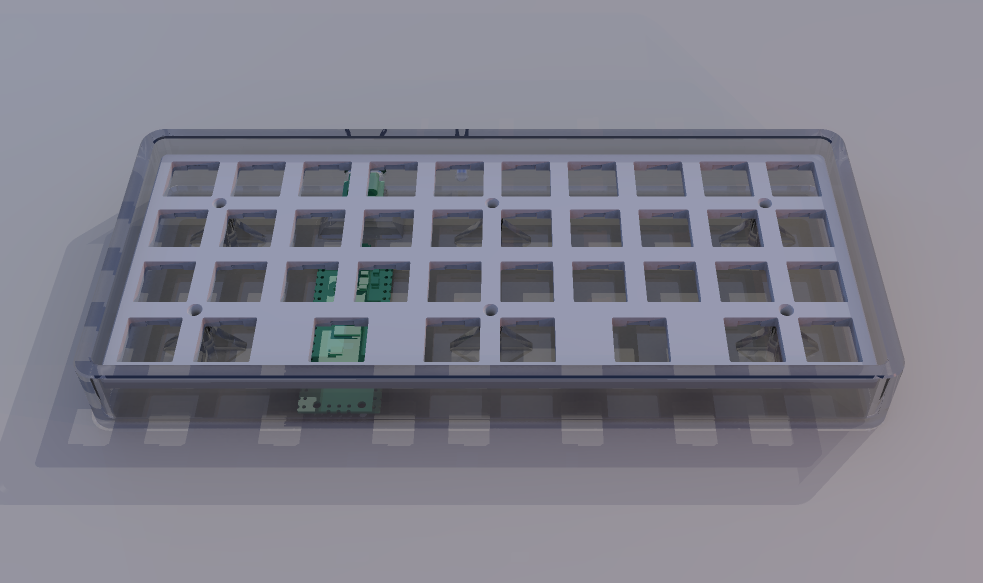

# Design

## Current Design

The layout is a typical 10 column 4 row orthographic keyboard, with a pair of 2u keys on the thumb row. The case is a Hi-Profile shell with a 3.5mm switch plate secured using screws and heatset inserts that are placed in the shell. I couldn't decide on angling so I left it flat.

The board uses a Raspberry Pi Pico and USB-C breakout board, mostly because I have a few unused ones just laying around. Otherwise I would have chosen a RP2040 board with a USB-C connector. No OLEDs, no RGB, no rotary encoders.

## Sketches and Woolgathering

The easiest design would have been to use a pair of plates with some sort of spacers between them. This is nice for prototypes, but I'm personally not a fan of the look.

The next option would be to use an upside-down shell with a concealed bottom plate. The bottom of shell be less susceptible to flex compared to a flat plate due to the walls forming a ribbon. The MCU can be placed on the bottom plate, and by screwing it in from the bottom, conceal the screws. However this only lets us have a Low-Profile floating style.

The option I settled for was a right-side-up shell and the switches mounted on a plate that is secured down via screws that are placed between the switches. I find this the easiest way to get a Hi-Profile case where the walls can be higher than the surface of the plate.

The rest of the sketches are just notes to make sure I don't overlook any clearances inside. When setting aside the volume for your controller, make sure to include both the header pins, as well as any connectors you might be connecting to them.

---

⏯️ *Design* | ⏩ [Construction](Construction.md) | ⏏️ [README.md](../README.md)