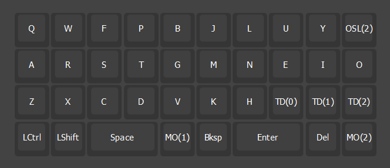
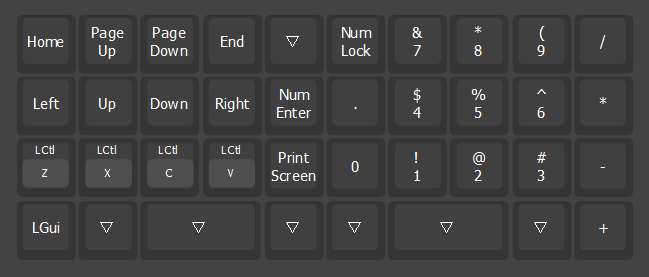
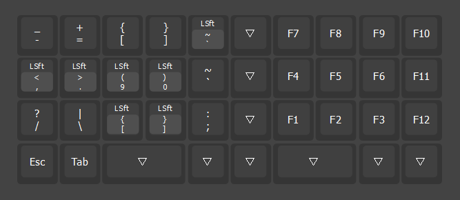

# Firmware
## QMK and Vial
The design is a standard single board matrix with a RP2040 controller, so not much to write home about.

If for some reason you need to use the firmware, you'll probably have to change the pins in `cae86/qazortho38/info.json` to whichever pins you are using, and enable VIAL insecure mode in `cae86/qazortho38/keymaps/vial/rules.mk` while you are debugging.

## Keymap
This is my first ortholinear keyboard, so I'm still trying to figure out a keymap that works for me.
### Layer 0

### Layer 1

### Layer 2

---

⏪ [Construction](Construction.md) | ⏯️ *Firmware* | ⏩ [Gallery](Gallery.md) | ⏏️ [README.md](../README.md)